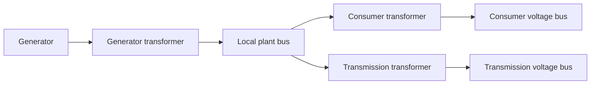

# Main plant controller

This computer supervises multiple existing `Powerplant/regulator` transformer controllers. It displays a local grid voltage gauge, an optional grid current gauge, transformer telemetry and controls on a touch monitor. Generator/consumer/transmission roles have independent output buses. An upstream controller can prepare voltage changes and coordinate isolation and rednet generator commands. Generator-side actuator software and the upstream power-allocation algorithm remain separate programs.

## Install

Copy these three files together onto the main computer:

- `plant_controller.lua`
- `controller_core.lua`
- `controller_ui.lua`

Attach a **touch-capable advanced monitor**, an **ender modem** for computer-to-computer rednet, and the gauges. At text scale 0.5 the monitor must provide at least **51 columns × 22 rows**. Use a sufficiently large multi-block monitor. The controller sets that scale itself.

Run:

```text
plant_controller.lua configure
plant_controller.lua run
```

Configuration lists available compatible peripherals and lets you assign their roles by name or number. Blank keeps a setting; `-` clears optional roles. Enter transformer computer IDs and labels. On **every regulator**, configure `masterId` to this main computer's ID, and select its modem. Run those regulators in managed mode. The main controller learns their sessions from periodic status messages; it never enables an unconfigured computer discovered on rednet.

Defaults are nominal **2640 V**, healthy grid range **2376–2904 V** (±10%), grid sample age **1 second**, and transformer telemetry timeout **2 seconds**. Configure the actual installation's range. Each regulator independently enforces its own voltage and protection settings.

Configuration v2 migrates v1 transformer entries to role `generator`, output bus `local`, parallel joining and no generator association. Configuration is saved as `plant-controller-config.json` in the working directory. The main controller adopts the reported state of v17 autonomous regulators on startup and does not send an unsolicited disable. Regulators persist their own explicit enable/disable state. Legacy lease-required regulators retain their older restart behavior. Optional `startup_optional.lua` can be renamed to `startup.lua` after commissioning; do not overwrite an existing startup file blindly.

## Where to measure

```text
Generator -> existing regulated transformer -> its breakers -> LOCAL PLANT BUS
                                                               |
                                               main voltage/current meters
                                                               |
                                  future transmission transformer -> remote line
```

The **main voltage gauge must measure the local grid side of the regulated transformers' breakers**, remaining readable while an individual unit is disconnected. Do not use an isolated transformer's own output gauge as the grid reference. `voltage()` must return volts.

The optional current gauge measures the intended aggregate load/export current. Its placement and orientation determine what is included. It uses `current()`, falling back to `getValue()`, and must return amps. Do not select a different meter merely because it has `getValue()`. Signed readings are retained; missing readings display `--`, never zero.

Current is **display-only by default**. A positive `currentLimitAmps` inhibits all transformer enable requests if the absolute current exceeds it or the assigned meter becomes unavailable. This is a supervisory, sampled limit; native breakers and the regulators' own protection remain independent. There is no automatic re-enable when current or voltage recovers.

## Monitor controls

The transformer overview shows connection freshness, reported phase, actual plus/minus breaker feedback, input/output voltage, configured/current targets, source voltage/current, all three stage positions and bank sizes, maximum temperature and spent recovery credits per stage, and faults/notices. Offline entries retain historical readings marked stale; those are not current contact confirmation.

Touch a row to select it. **Previous/Next** navigate larger fleets. Controls:

- **Enable:** sends fresh grid measurements with periodic enable dispatches. Requested enable and actual breaker state are displayed separately. Healthy fresh grid data and fresh fault-free transformer status are required.
- **Disable:** requests both output breakers open and continues disable heartbeats. Verify reported contacts.
- **Reset fault:** disables first, waits for a subsequent status acknowledging disable and confirming both contacts open, then requests reset. It waits for fault-free standby; an ACK alone never means reset completed. Hot/unavailable variacs can reject reset. A successful reset still requires a separate Enable.
- **DISABLE ALL:** disables every configured transformer. It does not operate generator shafts or clutches.
- **Generators:** read-only display of optional other-generator telemetry. Configure these sender IDs only when their software is available.

On the computer keyboard, **Space** disables all, **left/right** change selection, **Tab** switches transformer/generator views, and **Q** exits supervision while autonomous regulators continue locally. Ctrl+T/runtime errors also attempt to release supervision. Legacy lease-required units receive disable on supervisor exit. Nodes whose sessions are not yet known cannot be addressed. v17 regulators revert to local single mode when supervisor data expires; explicitly disabled units stay disabled. Send success is not proof of open contacts.

The program samples the local meters every 0.25 seconds and dispatches/renders every 0.5 seconds, subject to ComputerCraft scheduling and peripheral latency. For v17 autonomous regulators, loss of fresh supervisory grid/node data releases supervision and local single-mode regulation continues. Explicit disable and confirmed protection violations during active supervision still take priority. Legacy lease-required regulators retain the previous disconnect behavior. Parallel mode requires a healthy live output bus. Explicit exclusive-supply mode can energize an initially dead circuit as described below.

## Future transmission transformer

The long-distance transmission side is a **separate measurement domain**. Optional `transmission.inputGauge` / `transmission.outputGauge` display its input/output voltages. `transmission.ratio` is **output/input**, e.g. `10` for 2.64 kV → 26.4 kV; `0` means unknown. Gauges are sampled separately from the local grid so diagnostic delays do not replace the local sample timestamp.

These ports are diagnostic only. Their higher voltage never replaces the local bus reference and a missing transmission gauge does not inhibit local regulation. To control a regulated transmission transformer, add it to the fleet with role `transmission` and assign its high-voltage output bus. The legacy two diagnostic gauges remain optional and do not substitute for that bus reference.

## Future network controller and generators

`upstreamId=-1` disables the network-controller link. With an ID configured, this program sends `plant_status` telemetry every 0.5 seconds on `powerplant.controller.v1`. It includes local meters, transformer status, optional transmission measurements and optional generator readings.

Other generators may send `[voltage,current]` pairs inside a timestamped envelope, or named fields, as documented in [PROTOCOL.md](PROTOCOL.md). Unknown, stale, invalid and inconsistent readings are rejected. Measurements from different electrical sides are not blindly summed. Optional generator connection/disconnection preparation uses voltage adjustments calculated upstream from generator `maxPowerWatts` and `currentPowerWatts` reports; this program does not infer capacity from voltage × current. Scoped upstream shutdown preparation, cancellation, isolation and rednet start/stop routing are described below. No local clutch peripheral is operated. Rednet IDs/session checks do not provide cryptographic authentication; use the intended trusted in-game network.

## Checks

From the repository root:

```sh
lua Powerplant/controller/tests/controller.lua
lua Powerplant/controller/tests/runtime.lua
lua Powerplant/controller/tests/regulator_link.lua
lua Powerplant/regulator/tests/config_banks.lua
lua Powerplant/regulator/tests/thermal_protection.lua
```

Tests exercise the actual regulator receiver and native thermal reset rejection as well as supervision, meter freshness, sessions/sequences, reset sequencing, thermal-reset rejection, transmission separation, generator pairs, UI hit targets and the actual launcher with simulated peripheral/event scheduling. Hardware wiring, monitor sizing and in-game timing still require commissioning.

## Transformer roles and output buses

Configure each transformer with a `role` (`generator`, `consumer`, `transmission`), an output `bus` ID, a `connectionMode`, and optional `generatorId` association. Association identifies the transformers which must be isolated before stopping that generator. Each additional bus has its own voltage gauge, optional current gauge, nominal voltage, healthy range and current limit. `local` uses the original plant-bus settings.



For example, a 2640 V generator-transformer output can use `local`, a 240 V consumer transformer can use bus `consumer`, and a 26400 V transmission transformer can use bus `line`. Configure each regulator's own nominal target, winding/step-up settings and protection limits to match its hardware. The main controller never substitutes 2640 V for a consumer or transmission measurement. Enable is rejected if the regulator's reported nominal target falls outside the assigned bus range. A bus fault inhibits its assigned transformers; independent healthy buses retain their current requests.

The monitor displays the selected transformer's bus voltage/current, role, bus ID, configured target and active target. Supply-mode readiness is labelled as permission to energize a dead circuit, not as an already healthy live bus.

### Parallel or exclusive supply

- **parallel** (default): match an already-live output bus before closing. No dead-bus startup.
- **supply**: permitted only when this transformer exclusively owns the configured output bus. The main controller rejects multiple configured owners. Configure the **same mode and `deadBusVolts` on the regulator itself**; defaults are parallel and 5 V. The wiring must genuinely exclude other uncoordinated sources.

Supply mode uses a fresh actual low-voltage reading, never missing data, as evidence of a dead circuit. The regulator tunes its isolated output to the target, verifies it before each pole closes, and then requires the downstream bus to become live within its configured grid sample-age window. If the output bus is already live, it still voltage-matches before connecting. All thermal/current/voltage checks remain active. A missing gauge prevents startup. This permission is for a specifically commissioned exclusive circuit, not unrestricted black start of a multi-generator grid.

### Optional generator connection/disconnection preparation

1. Generators report actual `maxPowerWatts` and `currentPowerWatts` alongside voltage/current. Missing watts remain unknown; no invented zero or V×I replacement is supplied.
2. The upstream controller computes explicit temporary voltage targets using the generation/load information it has. `generator_transition` supplies direction `connect` or `disconnect`, a generator ID, event ID, expiry and transformer targets. `shutdown_prepare` remains a disconnect-preparation alias. This controller validates the entire batch before changing any target.
3. Regulators must opt in locally with `remoteTargetPercent>0` (default **0**, disabled). Targets must remain inside both the regulator's advertised range and its assigned bus range. Regulators ramp using existing local rate/step limits; nominal configuration is unchanged.
4. Telemetry reports `transitionAtTarget` only from fresh actual output and active setpoint readings with both breakers closed. It is an instantaneous observation, not a guarantee that reserve generation is adequate or an automatic permission to shut down.
5. The upstream may send `generator_isolate`. It disables associated source transformers. A later `generator_command` with `command="stop"` is forwarded only after fresh status acknowledges those disable sequences and confirms both contacts open on every associated transformer.
6. Start/stop requires the generator's own rednet controller to advertise a control session, supported commands and command sequence. Send/ACK is not physical completion; `running` status and applied command sequence confirm it. Starting a generator never enables its transformers automatically.

Temporary plans expire after at most **30 seconds** unless replaced by a fresh accepted plan. Cancellation/completion/expiry returns the target toward locally configured nominal at the normal ramp rate. A fault, disable, release of supervision, lost supervisory data or restart clears/invalidates the temporary request. Upstream silence cannot leave a permanent voltage override. Hardware protection and the master heartbeat lease still govern connection.


## Independent computers and ender-modem links

Install each program and its own companion Lua files on its own computer. No program loads files, wraps peripherals, or executes functions on another computer. Computer-to-computer traffic uses rednet computer IDs and the selected **ender modem**, including main ↔ regulator, main ↔ generator and main ↔ upstream links. Do not use a shared wired rednet network as the inter-computer link.

Configuration filters modem choices to wireless devices. At runtime wired modems are rejected for rednet and pre-existing rednet openings are closed before opening the configured wireless device. The [CC:Tweaked modem API](https://tweaked.cc/peripheral/modem.html) exposes `isWireless()` but no ender-specific identification method: install an actual ender modem, not a normal range-limited wireless modem. Wired modems may still expose **local** gauges, variacs, drives and monitors through peripheral sharing; closing rednet channels does not disable that peripheral network. Ender messages do not expose remote peripherals.

Local supervision, bus measurements and transformer protection do not require an upstream controller or generator telemetry to be online. Missing generator telemetry is marked unavailable and only blocks commands needing that generator's fresh feedback. An upstream send error does not stop the local controller. Temporary upstream targets expire normally; remote send success never proves action completion.

An absent/detached ender modem is retried automatically. The monitor continues reporting local data while communication is unavailable. A missing/detached monitor likewise does not terminate ongoing supervision; reconnect it with the configured name to restore the UI. Required local measurement failures still inhibit the affected bus, and a regulator's local electrical/thermal protections remain authoritative.

**v17 independent operation:** `autonomousFallback=true` is the regulator default. With no main controller present it runs using the existing single-mode algorithm, local input/output gauges and local nominal target. Losing a supervisor does not open an otherwise healthy, enabled transformer's contacts. Any temporary target is abandoned and returns toward nominal using the local ramp limits. No separate local bus gauge is required for this single-mode behavior. This is the existing standalone connection behavior, not a claim that an isolated output gauge measures an external live bus; fresh supervisor data is needed for supervised grid-matching checks.

An explicit Disable is persisted on the regulator and survives supervisor loss, release and reboot. Local faults still isolate the transformer. Reset does not enable it. To re-enable locally while the supervisor is absent, stop the regulator program, run `transformer_controller.lua enable`, then `transformer_controller.lua run`; the enable command itself leaves contacts open. `disable` writes the opposite intent. Keep `transformer-operation-state.json` and any `.tmp` recovery file during updates. Invalid saved intent prevents operation.

Set `autonomousFallback=false` locally only when the legacy requirement to disconnect on lost master lease is desired. `masterId=-1` still selects pure standalone operation without rednet. Ordinary local regulation always corrects output toward the fixed nominal voltage; optional connect/disconnect preparation is the only reason for an upstream temporary target. `remoteTargetPercent=0` remains the default, so that rarely used feature is disabled until explicitly commissioned.

Additional integration checks:

```sh
lua Powerplant/controller/tests/runtime.lua upstream_down
lua Powerplant/controller/tests/runtime.lua late_modem
lua Powerplant/controller/tests/runtime.lua wired
lua Powerplant/controller/tests/runtime.lua late_monitor
lua Powerplant/controller/tests/autonomy.lua
```
